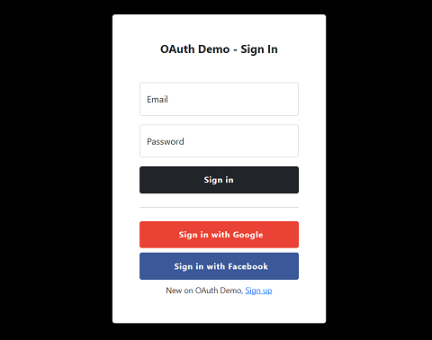

# OAuth Demo

<p align="center">
    
</p>

## Local testing with PHP built-in server

### Start PHP built-in server
```sh
php -S localhost:3092 -t web
```

### Local HTTPS protocol with Stunnel
- Download Stunnel from https://www.stunnel.org/downloads.html
- Install it
- Open configuration file `stunnel.conf` from `[installation path]/stunnel/config/` directory
- At the end of the file put the next part of the code:

```sh
[https]
accept  = localhost:9898
connect = localhost:3092
cert = stunnel.pem
```
- Save the configuration file and restart Stunnel
- Access the local website via: https://localhost:9898


## Facebook OAuth configurations

### Create a Facebook App
- Go to: https://developers.facebook.com/apps/create/
- Select "*Consumer*" for app type
- Add a name and finish creating your app

### Basic settings for Facebook App
- In the left menu, select *Settings* > *Basic*
- Fill in the fields: *"Display name"*, *"App domains"*, *"Privacy Policy URL"* and *'User data deletion
'*
- Save changes

### Facebook Login settings
- In the dashboard, add products *"Facebook Login"* to your app
- Comptele *"Site URL"* with `https://localhost`
- In the left menu, select *Facebook Login* > *Settings*
- Fill in *"Valid OAuth Redirect URIs"* with: `https://localhost:9898/sign-up` and `https://localhost:9898/sign-in`
- Set *"Login with the JavaScript SDK"* to `Yes`
- Fill in *"Allowed Domains for the JavaScript SDK"* with: `https://localhost:9898`
- Save changes

### Facebook App - Email and Public Profile access
- In the left menu, select *App Review* > *Permissions and Features*
- Search for *"email"* and *"Get advanced access*"
- Search for *"public_profile"* and *"Get advanced access*"

### Facebook App - Live Mode
- In the header menu, switch your app to *"App Mode: Live"*
- Copy `web/private/facebook-auth.json.dist` to `web/private/facebook-auth.json`
- Set `app_id` value to your *"Facebook App ID"*
- Set `app_version` value to your *"Facebook App Version"*, maybe `v14.0`

## Google OAuth configurations

### Create a Google Project
- Go to: https://console.cloud.google.com/projectcreate
- Add a name and finish creating your project

### Google OAuth consent screen
- In the left menu, select *"OAuth consent screen"*
- Choose *"User Type: External"* and *"Create"*
- Fill in *"App information"* fields
- Fill in *"App domain"* fields
- Add *"App domain"*
- Add *"Developer contact information"*
- Save and continue
- Just *"Save and continue"* next steps

### Google OAuth 2.0 Client IDs
- In the left menu, select *"Credentials"*
- In the header menu, select *"Create Credentials"* > *"OAuth client ID"*
- Select "*Web application*" for "*Application type*"
- Fill in "*Name*" field
- For "*Authorized JavaScript origins*", add `https://localhost`
- For "*Authorized redirect URIs*", add `https://localhost/api/sign-up/google-callback` and `https://localhost/api/sign-in/google-callback`
- "*Create*" to finish
- Backup "*Client ID*" and "*Client Secret*"

### Google - Publish App
- In the left menu, select *"OAuth consent screen"*
- Click *"Publish App"* under *"Publishing status"* section
- Copy `web/private/google-auth.json.dist` to `web/private/google-auth.json`
- Set `client_id` value to your backuped Google *"Client ID"*
- Set `client_secret` value to your backuped Google *"Client Secret"*
